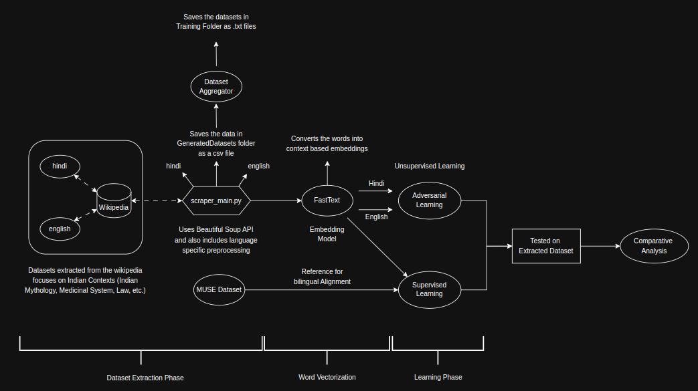
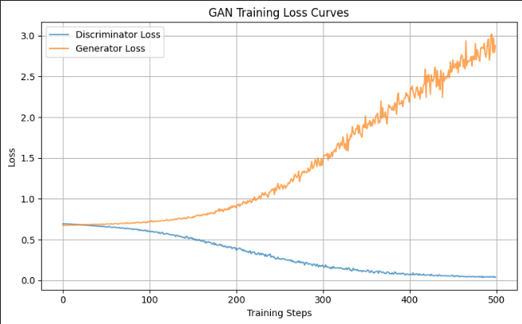

# Hands-on word-to-word Translation for Low-Resource languages

``Note`` : Everything is implemented from scratch

---

## 📖 Table of Contents  
- [Flow Diagram](#-flow-diagram)  
- [Instructions to run](#-Instructions-to-run)
- [Traditional Supervised Approach](#-traditional-supervised-approach)  
- [Unsupervised Approach](#-unsupervised-approach)  
- [Challenges Faced](#-challenges-faced)
- [References](#-references)

---

## Instructions to run

#### On windows/linux platform
- Create a `venv` or a new conda environment just to avoid conflicts with already existing libraries. (**Optional**)
- run [`setup.sh`](.setup.sh) file which will install all the required libraries ([`reuirements.txt`](requirements.txt)) and the muse dataset. 
- The datasets that are extracted using [`web_scraper_cpu.py`](./DataExtraction/web_scraper_cpu.py) are kept in the [`GeneratedDatasets`](./GeneratedDatasets/) and are further converted to a format that is used to train the fasttext and kept in the [`Training`](./Training/) folder. 
- Run [`train_fasttext.py`](./Training/train_fasttext.py) file which generates fasttext model files in a folder named `custom_models`
- Now run the ['ProcrustesSupervisedAlignment.ipynb'](./Training/ProcrustesSupervisedAlignment.ipynb) and ['ProcrustesUnsupervisedAlignment.ipynb'](./Training/ProcrustesUnSupervisedAlginment.ipynb) for supervised and unsupervised embedding alignment process. 

## 📊 Flow Diagram

**_Figure: End-to-end pipeline for both supervised and unsupervised language translation_**

---

## Traditional approach (Supervised Approach): 

This method requires **parallel corpora** (source ↔ target language word pairs).

### Pipeline

1. **Dataset creation Phase**
    - Creation of parallel corups: `(src_language, translated_language)`
    - Refer [`web_scraper_cpu.py`](./DataExtraction/web_scraper_cpu.py) for dataset extraction using beautiful soup and [`aggregator.py`](./GeneratedDatasets/aggregate.py) for Dataset accumulation.
2. **Vectorization Phase** 
    - Use an embedding model to convert the `words` -> `vectors` (embeddings)
    - Refer [`train_fasttext.py`](./Training/train_fasttext.py)
3. **Mapping phase**
    - Learn a **transformation matrix** that maps source embeddings to target embeddings (embeddings of target vocab)

### 🧠 Core Idea:

I used **Procrustes Analysis**, a linear mapping technique to align word embeddings from the source language space to the target language space.

> The transformation matrix is learned using **Singular Value Decomposition (SVD)**.

Refer: [`ProcrustesSupervisedAlignment.ipynb`](./Training/ProcrustesSupervisedAlignment.ipynb)

- In the code presented, the GAN has been trained for 500 epochs on approx 10,000 monolingual vocab datasets (english and hindi)

---

## Unsupervised Approach  

Inspired by **GANs (Generative Adversarial Networks)**, this method works **without parallel corpora**.

#### Key Concepts:
- No need for `(src, tar)` word pairs
- Deals with src and tar language independently 

#### Two-Phase Training:

#### **Phase 1: Adversarial Training**
- **Generator** learns to transform source embeddings to appear like target embeddings
- **Discriminator** learns to distinguish between real target embeddings and generated ones
- Both networks are trained simultaneously in a **min-max** fashion

#### **Phase 2: Pseudo Target Word Generation**
- Use the trained Generator to produce `k` nearest target embeddings
- Map these embeddings to actual words using:
  - **K-Nearest Neighbors (KNN)**
  - **Cross-Domain Similarity Local Scaling (CSLS)**

Refer: [`ProcrustesUnSupervisedAlignment.ipynb`](./Training/ProcrustesUnSupervisedAlginment.ipynb)

 
**_Figure: Training curves upon GAN Training_**

---

## Challenges Faced : 

One of the major challenge in building an AI model (language/image) is for Indic language is its complexity (Compound words, Character Clusters) and lack of proper tokenizers.

### Language Complexity
- Low-resource languages like Hindi lack well-defined tokenizers and linguistic tools
- Refer [`DealWithLanguageComplexity.ipynb`](DealWithLanguageComplexity.ipynb)
### Compound Words
- Many Indic words combine in irregular ways, making them difficult to split or process automatically

### Lack of GPU-compatible Preprocessing
- Libraries used for preprocessing (e.g., regular expressions) often **lack GPU support**, slowing down data preparation

### KNN Asymmetry 
- KNN search isn't symmetric: `y` might be in KNN of `x`, but `x` isn't necessarily in KNN of `y` \[1\]
- **Solution**: Use `CSLS` to balance this discrepancy

## 📚 References

1. Conneau, A., Lample, G., Ranzato, M., Denoyer, L., & Jegou, H.  
   **"Word translation without parallel data"**, [arXiv:1710.04087](https://doi.org/10.48550/arXiv.1710.04087), 2017  
2. [**Multilingual Unsupervised and Supervised Embeddings (MUSE)** - Facebook Research](https://github.com/facebookresearch/MUSE)  
3. Zhu, J.-Y., Park, T., Isola, P., & Efros, A. A.  
   **"Unpaired Image-to-Image Translation Using Cycle-Consistent Adversarial Networks"**,  
   *IEEE ICCV 2017*, [DOI: 10.1109/ICCV.2017.244](https://doi.org/10.1109/ICCV.2017.244)